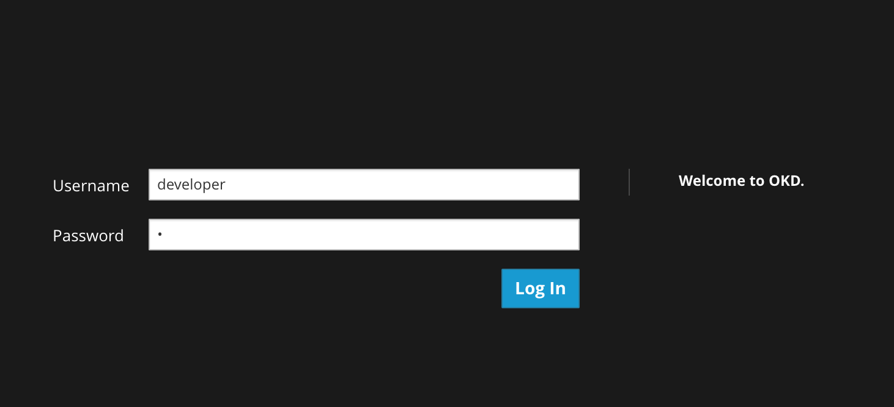

# Lab 2: OpenShiftアプリケーションの作成

[前のLab（Lab1）](../Lab1/README-ja.md) の指示に従ってプロジェクトを作成したら、次のステップはクラスター内にOpenShiftアプリケーションを作成することです。

## 1. アプリケーションの作成 

OpenShiftでアプリを作成する方法はいくつかあります。

- ソースコード
- DockerHub イメージ
- OpenShift テンプレート
- OpenShift UI

### 1.1 ソースコードからアプリケーションを作成

`oc new-app`コマンドを使用すると、既存のソースコードからOpenShiftでローカルまたはリポジトリのURLを使用してアプリケーションを作成できます。 ソースリポジトリが指定されている場合、 `new-app`は使用するビルド戦略（** Docker **または** Source **）を確認します。
前者の場合、実行可能なイメージが作成されますが、後者の場合、「new-app」はプロジェクトのルートディレクトリ内のファイルを見て適切なビルダーを使用して言語を識別しようとします。

ローカルDockerfileからビルドする：
```
$ oc new-app /path/to/local/or/remote/Dockerfile
```

ソースコードからビルドする:
```
$ oc new-app path/to/local/or/remote/repository.git
```

### 1.2 DockerHub イメージからアプリケーションを作成

Dockerと同様に、OpenShiftもパブリックイメージレジストリDockerHubに対して構成されます。 DockerHubに存在するイメージを指定する場合、 `new-app`コマンドはこのイメージから直接実行可能なイメージを作成します。

たとえば、公式のnginxイメージからアプリを作成する場合、次を実行します。
```
$ oc new-app nginx
```

ただし、DockerHubレジストリに限定されません - Dockerと同様に、プライベートレジストリに保存されているイメージも指定できます。
```
$ oc new-app myregistry:8000/example/image
```

### 1.3 OpenShiftテンプレートからアプリケーションを作成

OpenShiftテンプレートは、基本的にはOpenShiftの準備が整った初期アプリケーションです。 これらは、コンテナにデプロイされる頻繁に使用されるアプリケーションをカバーします。
例）Ruby、Node、MongoDB
[nodejs template](https://github.com/sclorg/nodejs-ex#openshift-origin-v3-setup) は次のようになります:

```
nodejs-ex
├── openshift
│   └── templates
│       ├── nodejs.json
│       ├── nodejs-mongodb.json
│       └── nodejs-mongodb-persistent.json
├── package.json
├── README.md
├── server.js
├── tests
│   └── app_test.js
└── views
    └── index.html
```

デプロイすると実行できます:

```
$ oc new-app -f /path/to/nodejs.json
```


このテンプレートはレポジトリに存在するので、 [セクション1.1](./#11-ソースコードからアプリケーションを作成) で説明されているように、ソースから実行することもできます。

### 1.4 OpenShift UIからアプリケーションを作成

もし、CLIを使うのが苦手な場合で、GUIでクラスターにアプリケーションをデプロイしたい場合は、OpenShiftコンソールを使用するオプションもあります。 これは、 [setup](../README-ja.md#OpenShiftサーバーの開始) を参照して下さい。 :

```console
$ minishift start
...

Webコンソールからサーバーへアクセスできるようになりました:
    https://192.168.64.11:8443/console

以下でログインします:
    User:     developer
    Password: <any value>
```

UIにログインします:



`minishift start`の出力で述べたように、ユーザー_developer_とパスワードを任意の文字列（最低1文字）で、UIにアクセスできます。

カタログへアクセスします:


ログインすると、ブラウザカタログにリダイレクトされます。ここには、デプロイすることを選択できるサンプルアプリケーションが多数あります。 これは、 [セクション1.2](./#12-DockerHub-イメージからアプリケーションを作成) で見たOpenShiftテンプレートの手順を反映しています。 プロジェクトを作成してプロジェクトを切り替えることもできますが、コンソールカタログで提供されているサンプルアプリケーションに制限されていることに注意してください。

`new-app` コマンドを使用してOpenShiftアプリケーションを作成する方法の包括的な概要については、この [参照](https://docs.openshift.com/enterprise/3.0/dev_guide/new_app.html) を参照してください。

おめでとうございます！ OpenShiftでアプリケーションを作成するいくつかの方法を学びました！ OpenShiftでアプリケーションを管理する方法を見るために、 [次のラボ（ラボ3）](../Lab3/README-ja.md) に進みましょう。
