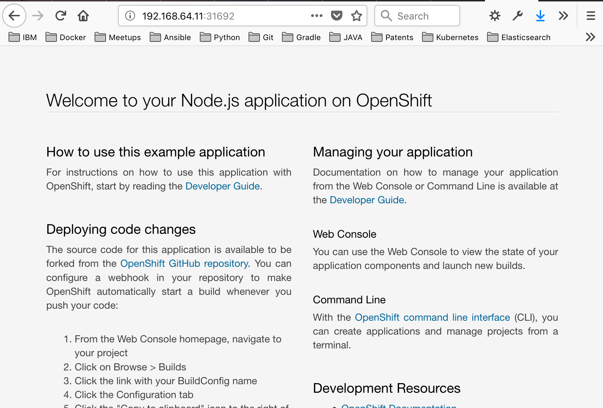

# 4. OpenShiftアプリケーションの公開

[前のLab（Lab3）](../Lab3/README-ja.md) の指示に従ってアプリケーションが稼働していることを確認したら、次のステップは、クラスター外のアプリケーションのアクセスを構成することです。 これを行うには、いくつかの方法があります。

- Node-port services
- Port-forwarding
- Routes

## 4.1 Node port services

これは、OpenShift環境外のアプリケーションにローカルおよびパブリックの両方でアクセスする最もクリーンな方法です。 この方法は、本質的に、クラスターノードのIPと範囲（30000〜32767）の間のポートを利用し、OpenShiftはこのポートを介して基になるアプリケーションにプロキシするように指示されます。これはいくつかの理由で次の2つのソリューションよりも優れています。ポートの衝突を心配する必要はありません。これは非HTTPベースのサービスで機能し、パブリックホスト名を必要としません。

NodePortを介してデプロイを公開するには _load balancer_type でデプロイを公開し、 _nodejs-ex-ingress_ という名前でラベルを付けます:
```console
$ oc expose dc nodejs-ex --type=LoadBalancer --name=nodejs-ex-ingress
service/nodejs-ex-ingress exposed
```

作成されたNodePortを確認するには、次を実行します:
```console
$ oc get --export svc nodejs-ex-ingress
NAME                TYPE           CLUSTER-IP   EXTERNAL-IP    PORT(S)          AGE
nodejs-ex-ingress   LoadBalancer   <none>       172.29.51.89   8080:31692/TCP   <unknown>
```

NodePortは、次のコマンドで見つけることができるクラスターの内部または外部IPと組み合わせて使用できます:
```console
$ oc get node -o wide
NAME        STATUS    ROLES     AGE       VERSION           INTERNAL-IP     EXTERNAL-IP   OS-IMAGE                KERNEL-VERSION              CONTAINER-RUNTIME
localhost   Ready     <none>    13h       v1.11.0+d4cacc0   192.168.64.11   <none>        CentOS Linux 7 (Core)   3.10.0-957.5.1.el7.x86_64   docker://1.13.1
```

これによりブラウザでアプリケーションにアクセスできるようになりました。 この例では `192.168.64.11：31692` のNodeアプリケーションにアクセスできます:



## 4.2 Port-forwarding

あるいは、クラスターの特定のポッドのポートにすばやくアクセスする場合は、oc `port-forward` コマンドを使用することもできます:

```
$ oc port-forward POD [LOCAL_PORT:]REMOTE_PORT
```

## 4.3 Routes

Webアプリケーションの場合、最も一般的な公開方法はRoutesです。 Routesは、サービスをホスト名として公開します。 これを行うには、使用可能なホスト名がある場合にコマンドを実行します:

```
$ oc expose svc/nodejs-ex --hostname=www.example.com
```

おめでとうございます！ このワークショップのすべてのラボを完了しました！ 以下の方法を学びました:
- OpenShiftプロジェクトの作成
- OpenShiftアプリケーションの作成（各種方法）
- アプリケーションステータスの監視
- アプリケーションの公開とアクセス

Minishiftの操作方法の詳細については [Minishift docs](https://docs.okd.io/latest/minishift/index.html) を確認してください。
